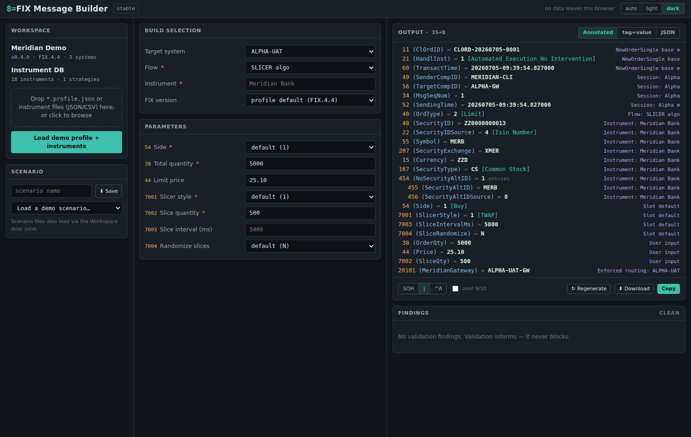

# FIX Message Builder

A fully client-side, static web application for composing [FIX protocol](https://www.fixtrading.org/) test messages. Instead of maintaining hundreds of hand-written message files, you select composable building blocks (target system, flow, instrument…), fill in parameter slots, and render the result as raw tag=value, configurable JSON, or an annotated human-readable view.



## Privacy model

**No data ever leaves your machine.** This is a hard design constraint, not a best effort:

- **Zero network activity after page load.** No analytics, no telemetry, no CDN resources, no font fetches — everything is bundled.
- Enforced by a strict **Content-Security-Policy** (`connect-src 'none'`) baked into the page, so the browser itself blocks any request the app could attempt.
- Enforced again in **CI**: every build is scanned for `fetch`/`XMLHttpRequest`/`sendBeacon`/WebSocket usage and external URLs (`npm run check:privacy`). Any hit fails the build.
- Profiles, instrument databases, and scenarios are loaded via file picker or drag-and-drop, and exported via file download or clipboard.

The public repository contains a generic engine and UI with **no knowledge of any specific trading environment**. All environment-specific detail — server names, bespoke routing tags, algo parameter sets, instrument universes, output mappings — lives in a _profile_: a config bundle you load locally at runtime and keep in your own private version control. This repo ships a fictional demo environment ("Meridian") only.

## What it does

- **Composable fragments** with deterministic merge semantics: base template → system routing → flow → instrument → user values → enforced final fragment. Every field carries **provenance** (which fragment set it, what it overwrote) surfaced in the UI.
- **Target systems as a first-class selector**: capability tags gate flows per system; retargeting a scenario to a different system re-resolves everything and surfaces anything that no longer fits as findings — never silent breakage.
- **Instrument identity conventions** (§3.10 of the [brief](docs/BRIEF.md)): the same instrument record renders as ISIN-decomposed tags (48/22, 55/200/201/202) on one system and a composed house code on another — and the same convention emits the Instrument, InstrumentLeg (600-series), and UnderlyingInstrument (300-series) contexts.
- **Order groups**: batches of independent orders sharing generated ListIDs, true 35=E lists with the rows as NoOrders entries, and 35=AB multileg orders built from strategy records.
- **Deterministic generators**: sequences (message/batch/persistent scope), FIX timestamps (s/ms/µs), templates like `CLORD-{date:yyyyMMdd}-{seq:4}`, shared per-batch values, seeded randoms.
- **Validation that informs, never blocks**: required/unknown/enum/type/group rules with per-profile and per-system severity remapping — deliberately malformed messages are legitimate test inputs, so even errors only badge the output.
- **Renderers**: tag=value with correct header ordering and BodyLength/CheckSum (known-answer tested against a reference implementation), a profile-configurable JSON mapping (key styles, group shapes, typed values, envelopes), and the annotated view.
- **Scenarios**: the whole builder state round-trips losslessly to a JSON file with canonical formatting and unknown-key preservation — a git-friendly replacement for static message libraries.
- **FIX 4.2 / 4.4 / 5.0 SP2** dictionaries, converted from the QuickFIX XML specs at dev time (`scripts/convert-quickfix.mjs`) and lazy-loaded per version.
- **Embedded mode** for internal integrations: a host page can iframe the builder, inject profile/instruments via `postMessage`, and receive send requests to deliver however it likes — the builder itself still makes zero requests. See [docs/INTERNAL-HOST.md](docs/INTERNAL-HOST.md) and the live [`host-demo.html`](host-demo.html) echo demo; a ready-to-fill host page skeleton ships in [docs/internal-host/](docs/internal-host/).

JSON Schemas for the profile, scenario, and instrument-DB formats live in [docs/schemas/](docs/schemas/) for IDE autocomplete when editing by hand. **[docs/PROFILE-AUTHORING.md](docs/PROFILE-AUTHORING.md)** is a self-contained guide to building a private profile from an environment spec — written so an AI assistant (or a colleague) can produce a working config without access to this codebase.

## Architecture

Two layers, with the boundary enforced by lint rules:

- **`src/engine/`** — pure TypeScript, zero DOM/browser dependencies, zero runtime dependencies. Canonical message representation, dictionaries + overlays, fragment merge, generators, validation, renderers, instrument identity, scenario (de)serialization, workspace seam.
- **`src/ui/`** — React components over the engine's public surface. Thin: no business logic; one reducer, memoized engine calls.

Stack: TypeScript (strict, `exactOptionalPropertyTypes`, `noUncheckedIndexedAccess`), Vite, React, Vitest (engine ≥90% line coverage; table-driven tests, known-answer vectors, property-based round-trips), ESLint + Prettier. GitHub Actions runs typecheck, lint, tests, and the bundle privacy check on every push.

### Branches and deployment

GitHub Pages serves two channels from the one site this repo gets:

| Branch | URL                                     | Purpose                                      |
| ------ | --------------------------------------- | -------------------------------------------- |
| `main` | `https://<owner>.github.io/<repo>/`     | Stable                                       |
| `dev`  | `https://<owner>.github.io/<repo>/dev/` | Rapid iteration; merge to `main` when stable |

A push to either branch rebuilds and redeploys both (a Pages deployment always replaces the whole site), each with the privacy check applied. `main` is protected and only changes via pull request from `dev`; the full branch model, merge policy, and repository-settings checklist are in [docs/WORKFLOW.md](docs/WORKFLOW.md).

## Development

```sh
npm ci            # install
npm run dev       # dev server
npm run test      # unit tests (npm run test:watch / test:coverage)
npm run verify    # everything CI runs: typecheck, lint, format, test, build, privacy check
```

A [devcontainer](.devcontainer/devcontainer.json) is included, so **GitHub Codespaces** works out of the box: create a codespace on `dev`, run `npm run dev`, and open the forwarded port — no local setup needed. Handy for development from a phone or tablet.

To regenerate the FIX dictionaries from the QuickFIX XML specs:

```sh
node scripts/convert-quickfix.mjs FIX44.xml --out src/engine/dictionary/data/fix44.json
node scripts/convert-quickfix.mjs FIX50SP2.xml --fixt FIXT11.xml --out src/engine/dictionary/data/fix50sp2.json
```

## Configuration at scale: the profile workspace

Hand-editing one large profile JSON does not scale past a handful of links. The **profile workspace** ([docs/PROFILE-WORKSPACE.md](docs/PROFILE-WORKSPACE.md)) is a files-per-entity source format — one file per link, per flow/algo, per convention — compiled by the dependency-free `fixb` CLI (Node ≥ 14.18, no npm) into the profile/instrument JSON the app consumes. A single `params` entry declares a custom tag's dictionary definition _and_ its form field; enabling an algo on a link is one string in one array. The build validates through the real engine loader, emits a human `BUILD-REPORT.md` (algo×link matrices, semantic lint), optional golden messages so config PRs diff as FIX, and `fixb explode` migrates an existing profile losslessly.

## Status

Milestones 1–5 and 8 of [docs/BRIEF.md](docs/BRIEF.md) §9 are implemented (engine core, composition, builder UI, order groups, JSON renderer + scenarios, ship), plus the FIX 4.2/5.0 dictionaries, the embedded host bridge for internal integrations, and the profile-workspace toolchain above. In progress: Chromium File System Access workspace mode (milestone 6) and in-app instrument editing (milestone 7; target-system editing is deliberately delegated to the fixb workspace, where changes are git-reviewed and lint-checked). Deferred: per-message zip export, CSV paste into the grid.

## License

Not yet chosen.
